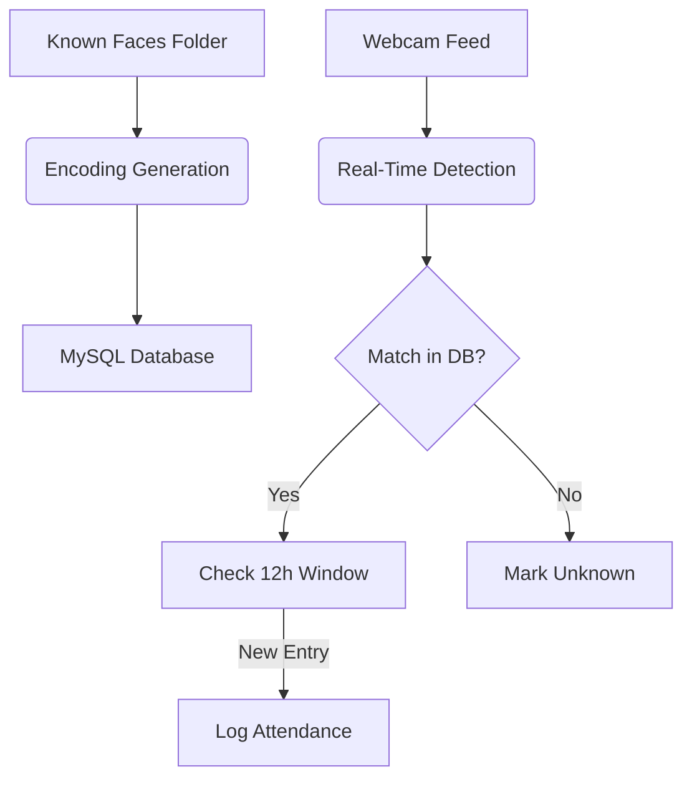

# 🎯 Automated Attendance System Using Face Recognition  
*Track attendance in real-time with facial recognition and MySQL logging*

The goal of this project is to implement a real-time face recognition system that stores images of known faces in a MySQL database, detects faces via webcam, and logs detected faces while ensuring no duplicate entries within a 12-hour window.

---

## ✨ Features
- **Facial Database**: Encodes the known faces in images and stores the face encodings in a database.
- **Real-Time Detection**: Real-time face detection using a webcam.
- **Smart Logging**: Records attendance only once every 12 hours.
- **Attendance Reports**: Easy tracking via database timestamps.

---

## 🛠 Technologies

- **Core Libraries**: 
  - `face_recognition` (Face detection/encoding)
  - `OpenCV` (Webcam streaming)
  - `mysql-connector` (Database operations)
- **Supporting Libraries**: `numpy`, `base64`

---

## 🚀 Setup Guide

### 1. Prerequisites
 - Python 3.x

 - MySQL (or any compatible relational database)

 - Install Dependencies

Run the following command to install required Python libraries:
`pip install face-recognition opencv-python numpy mysql-connector-python`

### 2. 🗃 Database Structure

| Table  | Columns | Purpose | 
| ------------- | ------------- | ------------- |
| known_faces |	id, name, encoding, timestamp	| Stores registered face encodings |
| detected_faces | id, detected_name, timestamp	| Attendance log with 12-hour deduplication |

`
## How It Works

### 1. Process and Store Face Encodings

- The script scans a directory containing images.

- Extracts and encodes face embeddings.

- Stores encodings in the known_faces table.

### 2. Face Recognition & Logging

- The webcam captures real-time video frames.

- Faces are detected, encoded and then compared with stored encodings.

- If a match is found, the detected face is logged in detected_faces.

- The system ensures that each person is logged only once every 12 hours.

 ### 🔄 Workflow

## Usage

- Running the Script

  - Ensure your MySQL database is running.

  - Update the database connection details in the script.

  - Run the script using:  `python face_recognition.py`

  - The webcam will activate, and the system will start recognizing faces in real-time.

- Adding New Faces

  - Place new images in the designated images/ directory.

  - Run the script to process and store new encodings.

##  File Structure
├── images/               # Directory for known face images

├── face_recognition.py   # Main Python script

├── console.sql           # SQL queries

└── README.md             # Documentation

